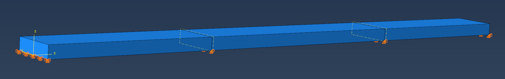
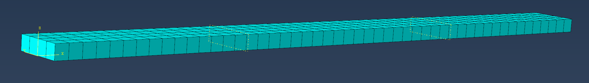
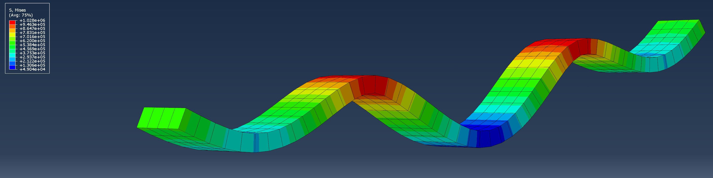
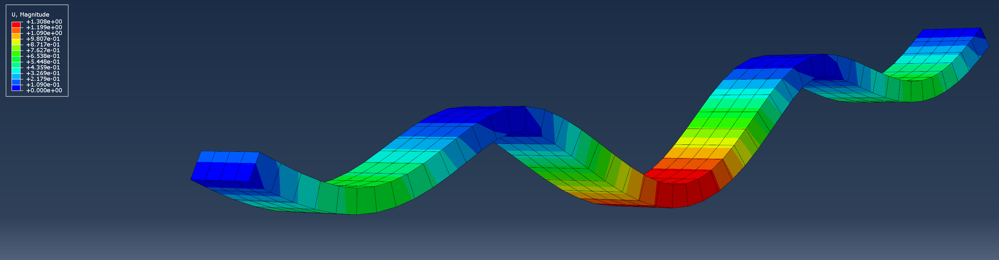
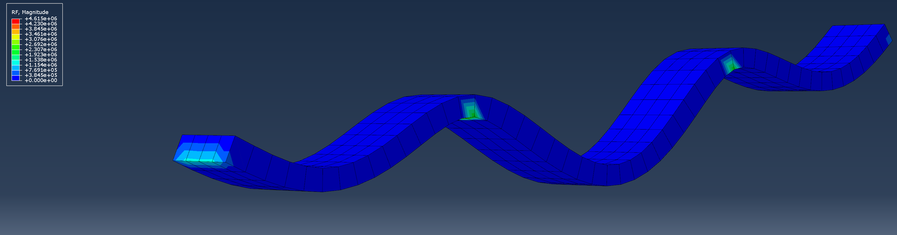

# Text to Bridge

Text to Bridge is a Python + Abaqus workflow for automated bridge finite element model production, analysis execution, diagnosis, rule-based repair, result extraction, and reporting.

The project currently contains four complementary workflows:

- **V1 Analysis Workflow**: reads a structured bridge JSON file, generates an Abaqus `.inp`, runs Abaqus, diagnoses errors, applies deterministic repairs, extracts results, and writes reports.
- **V2 Multi-Agent Model Production Workflow**: uses deterministic agents to transform a bridge semantic model into a reviewable Abaqus/CAE Python script, then optionally builds `.cae` and `.inp` files through Abaqus/CAE noGUI.
- **V3 Rigid-Frame Design Workflow**: references local rigid-frame Abaqus samples and generates an optimized three-span continuous rigid-frame bridge with variable girder depth, monolithic solid girder-pier geometry, support definitions, and prestress tendon layout.
- **V4 Hollow-Box Rigid-Frame Workflow**: upgrades the rigid-frame solid model to a hollow box-girder representation with C3D8R top slab, webs, bottom slab, embedded tendon paths, and rule-based section/prestress control.

The system is designed as a future LLM-agent toolchain, but the current implementation is intentionally deterministic and does not call external LLM APIs.

## Repository Structure

```text
bridge_fem_agent/
  main.py
  config.py

  schemas/
    bridge_schema.py

  semantic/
    bridge_model.py

  agents/
    document_agent.py
    reference_agent.py
    geometry_agent.py
    idealization_agent.py
    material_agent.py
    mesh_agent.py
    boundary_agent.py
    load_agent.py
    qa_agent.py
    model_production_workflow.py

  builders/
    abaqus_cae_builder.py

  rigid_frame/
    schema.py
    design.py
    builder.py
    solid_builder.py
    hollow_box_builder.py
    workflow.py

  tools/
    inspect_cae.py

  inp/
    inp_builder.py
    inp_parser.py
    inp_editor.py

  runner/
    abaqus_runner.py
    job_monitor.py

  diagnosis/
    log_parser.py
    error_classifier.py

  repair/
    repair_rules.py
    repair_engine.py

  results/
    dat_extractor.py
    odb_extractor.py
    abaqus_odb_extract.py
    report_writer.py

  examples/
    simple_girder_bridge.json
    three_span_agent_bridge.json
    three_span_solid_bridge.json
    rigid_frame_v3_example.json

  tests/
    test_workflow.py
```

Large Abaqus outputs and reference samples are intentionally ignored by Git:

```text
runs/
samples/
*.cae
*.odb
*.dat
*.msg
*.sta
```

This keeps the repository lightweight while allowing local Abaqus verification.

## Requirements

- Python 3.10+ recommended
- Abaqus 2022 or compatible Abaqus installation for real model generation and analysis
- No third-party Python package is required for the core workflow

The code also runs in dry-run mode on machines without Abaqus.

## V1: Analysis Workflow

The V1 workflow generates a simple beam-based `.inp` model and can run Abaqus/Standard.

Dry run:

```powershell
python main.py --input bridge_fem_agent\examples\simple_girder_bridge.json --workdir runs\simple_girder_bridge --max-repairs 3 --dry-run
```

Real Abaqus run:

```powershell
python main.py --input bridge_fem_agent\examples\simple_girder_bridge.json --workdir runs\simple_girder_bridge --max-repairs 3
```

Custom Abaqus command:

```powershell
python main.py --input bridge_fem_agent\examples\simple_girder_bridge.json --workdir runs\simple_girder_bridge --abaqus-command "abaqus" --max-repairs 3
```

V1 outputs:

```text
runs/simple_girder_bridge/
  simple_girder_bridge_attempt_0.inp
  simple_girder_bridge.log
  simple_girder_bridge.msg
  simple_girder_bridge.dat
  simple_girder_bridge.sta
  simple_girder_bridge.odb
  report.json
  report.md
  workflow.log
```

## V2: Multi-Agent Abaqus Model Production

V2 introduces a multi-agent production pipeline:

```text
Structured JSON / drawing-derived data
  -> Bridge Semantic Model
  -> Deterministic model-production agents
  -> Reviewable Abaqus/CAE Python script
  -> Optional .cae / .inp generation
  -> Optional Abaqus/Standard verification
```

The V2 agents are:

- **DocumentAgent**: reads structured JSON and creates the bridge semantic model.
- **ReferenceAgent**: scans local `samples/**/*.jnl` files and summarizes reference Abaqus modelling patterns.
- **GeometryAgent**: creates bridge stations, span breakpoints, and geometry planning data.
- **IdealizationAgent**: selects beam or solid finite element idealization.
- **MaterialAgent**: prepares material and section definitions.
- **MeshAgent**: selects mesh size, element type, and mandatory breakpoints.
- **BoundaryAgent**: maps engineering support types to Abaqus boundary conditions.
- **LoadAgent**: maps gravity, deck pressure, and point loads to Abaqus load definitions.
- **QaAgent**: checks the model plan before Abaqus generation.
- **AbaqusCaeScriptBuilder**: emits the Abaqus/CAE Python build script.

### Beam Model Production

Generate only reviewable model assets:

```powershell
python main.py --workflow model-production --input bridge_fem_agent\examples\three_span_agent_bridge.json --workdir runs\three_span_agent_bridge_v2 --samples-dir samples
```

Generate assets and build `.cae/.inp` with Abaqus/CAE:

```powershell
python main.py --workflow model-production --input bridge_fem_agent\examples\three_span_agent_bridge.json --workdir runs\three_span_agent_bridge_v2_cae --samples-dir samples --build-cae
```

The beam model uses:

- Abaqus/CAE `BaseWire`
- B31 beam elements
- Rectangular beam section
- Gravity
- Beam line load converted from deck pressure
- Static Abaqus/Standard step

### Solid Model Production

Generate a solid bridge model:

```powershell
python main.py --workflow model-production --input bridge_fem_agent\examples\three_span_solid_bridge.json --workdir runs\three_span_solid_bridge_v2_cae --samples-dir samples --build-cae
```

The solid model follows the style observed in the local sample journals:

- `BaseSolidExtrude`
- `HomogeneousSolidSection`
- C3D8R solid elements
- `seedPart`
- `generateMesh`
- support section partitioning
- bottom support node sets
- gravity load
- deck pressure or equivalent top-node vertical load fallback
- static Abaqus/Standard step

## Verified Local Results

The V2 beam model was generated and solved successfully with Abaqus/Standard.

The V2 solid model was also generated and solved successfully:

```text
THE ANALYSIS HAS COMPLETED SUCCESSFULLY
```

Solid model verification directory:

```text
runs/three_span_solid_bridge_v2_cae_retry2
```

Extracted solid ODB summary:

```text
max_displacement = 1.3075553125059352
max_stress = 1051906.5
```

## V2 Solid Model Visualization

The following figures show the generated solid Abaqus model and its response fields.

### Figure 1. Model and Loads



### Figure 2. Mesh Model



### Figure 3. Stress Field



### Figure 4. Displacement Field



### Figure 5. Reaction Force Field



## V3: Continuous Rigid-Frame Bridge Design

V3 targets three-span continuous rigid-frame bridges inspired by the local sample under `samples/rigid frame`. The workflow keeps the current release deterministic:

```text
Three span lengths / JSON task
  -> rigid-frame semantic task
  -> variable-depth section design
  -> prestress tendon group design
  -> rule-based response estimate and optimization
  -> reviewable Abaqus/CAE Python script
  -> optional .cae / .inp generation
```

Generate an optimized model from span lengths:

```powershell
python main.py --workflow rigid-frame-v3 --spans 90 160 90 --pier-height 60 --workdir runs\rigid_frame_v3_cli --max-design-iterations 8 --model-level solid
```

Generate from JSON:

```powershell
python main.py --workflow rigid-frame-v3 --input bridge_fem_agent\examples\rigid_frame_v3_example.json --workdir runs\rigid_frame_v3_json --model-level solid
```

Build `.cae/.inp` with Abaqus/CAE noGUI:

```powershell
python main.py --workflow rigid-frame-v3 --input bridge_fem_agent\examples\rigid_frame_v3_example.json --workdir runs\rigid_frame_v3_solid_cae --model-level solid --build-cae
```

V3 outputs:

```text
runs/rigid_frame_v3_solid_cae/
  rigid_frame_semantic.json
  optimization_history.json
  final_design.json
  optimization_report.md
  rigid_frame_90_160_90_rigid_frame_solid_build.py
  rigid_frame_90_160_90.cae
  rigid_frame_90_160_90.inp
  rigid_frame_v3_report.json
  workflow.log
```

The generated Abaqus script currently uses:

- C3D8R solid elements for the monolithic variable-depth girder and pier rigid frame
- one extruded solid part for the main girder and both piers, so the pier-girder connection is continuous rather than tied after assembly
- T3D2 truss wire paths embedded in the concrete host for reviewable prestress tendon groups
- C50/C40 concrete and prestress steel material definitions
- pinned/roller abutment supports and fixed pier bases
- gravity, equivalent deck service load, and equivalent prestress balancing load
- static Abaqus/Standard service analysis

The previous B31 beam model remains available for fast global review:

```powershell
python main.py --workflow rigid-frame-v3 --spans 90 160 90 --pier-height 60 --workdir runs\rigid_frame_v3_beam --model-level beam
```

For the default `90 + 160 + 90 m` example, the deterministic optimizer reaches the configured serviceability targets within 8 design iterations. The final embedded-tendon solid `.inp` was solved with Abaqus/Standard in `runs/rigid_frame_v3_solid_embedded_cae`; the check ODB reported approximately:

```text
max_displacement = 0.2132945424954412
```

The extracted global `max_stress` in the embedded model includes both concrete and tendon elements, so concrete-only and tendon-only stress envelopes should be separated in future result extraction.

### V3 Improvements

The V3 release adds:

- a three-span continuous rigid-frame bridge generator from JSON or direct span input;
- deterministic section and prestress optimization before Abaqus model generation;
- monolithic solid girder-pier geometry using C3D8R elements;
- embedded T3D2 prestress tendon paths that deform consistently with the concrete host;
- C50/C40-style material separation for girder and pier regions;
- Abaqus/CAE noGUI generation of `.cae` and `.inp` files;
- Abaqus/Standard verification for multiple span combinations;
- Markdown/JSON reports for design history and validation.

### V3 Solid Model Gallery

Sample 1 uses the first V3 span set: `90 + 160 + 90 m`.


Sample 2 uses: `110 + 180 + 110 m`.


Sample 3 uses: `80 + 140 + 80 m`.


## V4: Hollow-Box Continuous Rigid-Frame Bridge

V4 keeps the V3 deterministic design loop but changes the default rigid-frame idealization to a hollow box-girder solid model. It is closer to the local rigid-frame sample because the girder is no longer a filled solid block.

Generate V4 review assets:

```powershell
python main.py --workflow rigid-frame-v4 --spans 90 160 90 --pier-height 60 --workdir runs\rigid_frame_v4_hollow_review_90_160_90 --max-design-iterations 8
```

Build `.cae/.inp` with Abaqus/CAE noGUI when the Abaqus license service is available:

```powershell
python main.py --workflow rigid-frame-v4 --spans 90 160 90 --pier-height 60 --workdir runs\rigid_frame_v4_hollow_90_160_90 --max-design-iterations 8 --build-cae
```

The V4 generated Abaqus script uses:

- C3D8R solid elements for top slab, bottom slab, webs, and piers;
- a true central void in the box girder;
- shared-node concrete host geometry for girder and piers;
- T3D2 prestress tendon paths embedded into the concrete host;
- C50/C40 concrete and prestress steel materials;
- left abutment, right abutment, and pier-base support sets;
- gravity, equivalent deck service load, and equivalent prestress balancing load;
- static Abaqus/Standard service analysis output requests.

The default `90 + 160 + 90 m` V4 example was generated through Abaqus/CAE and solved with Abaqus/Standard in:

```text
runs/rigid_frame_v4_hollow_cae_retry3_90_160_90
```

The service analysis completed successfully. Basic ODB extraction reported:

```text
max_displacement = 0.2560715425483322
max_stress = 110774688.0
```

The current stress maximum is global and may include prestress tendon elements; concrete-only and tendon-only stress envelopes are planned for the next result extraction upgrade.

### V4 Hollow-Box Model Gallery


V4 outputs are written under the selected work directory:

```text
runs/rigid_frame_v4_hollow_review_90_160_90/
  rigid_frame_semantic.json
  optimization_history.json
  final_design.json
  optimization_report.md
  rigid_frame_90_160_90_rigid_frame_hollow_box_build.py
  rigid_frame_v4_report.json
  rigid_frame_v3_report.json
  workflow.log
```

Detailed V4 design notes are available in [docs/V4_hollow_box_rigid_frame_design.md](docs/V4_hollow_box_rigid_frame_design.md).

## Testing

Run the standard-library test suite:

```powershell
python -m unittest discover bridge_fem_agent\tests
```

Current coverage includes:

- V1 dry-run analysis workflow
- deterministic `.inp` repair without overwriting prior attempts
- V2 beam model-production script generation
- V2 solid model-production script generation
- V3 rigid-frame variable-section and prestress optimization script generation
- V3 solid rigid-frame script generation with embedded tendon constraints
- V4 hollow-box rigid-frame script generation with C3D8R concrete blocks and embedded T3D2 tendon paths

## Design Principles

- Keep generated Abaqus artifacts under the selected `--workdir`.
- Never overwrite prior `.inp` attempts.
- Keep all repair actions auditable.
- Prefer deterministic rule-based repair before any future LLM reasoning.
- Use a semantic bridge model as the boundary between drawing/text understanding and Abaqus generation.
- Make Abaqus model production reviewable through generated Python scripts and QA reports.

## Future Work

- Add drawing/PDF/CAD extraction agents.
- Add shell and mixed beam-shell-solid model idealizations.
- Add connector-based bearing and support modelling.
- Add vehicle, temperature, wind, seismic, and load-combination agents.
- Improve ODB extraction for solid support reaction aggregation.
- Add result reasonableness checks such as total reaction versus total applied load.
- Upgrade V3/V4 prestress from equivalent balancing load to calibrated initial stress/strain and staged construction.
- Add drawing-driven hollow-box section extraction for V4.
- Add element-set-based result extraction for concrete stress and tendon stress separately.
